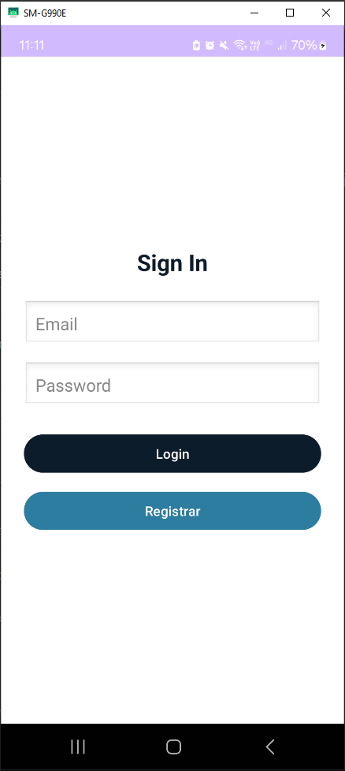
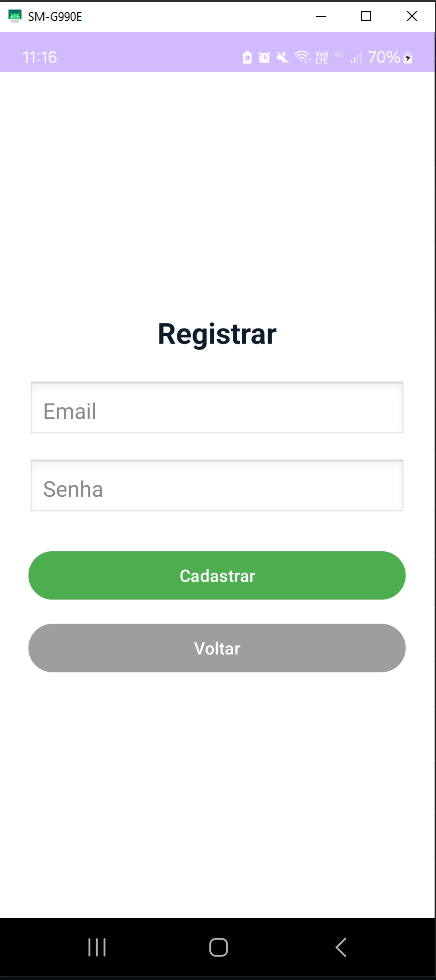
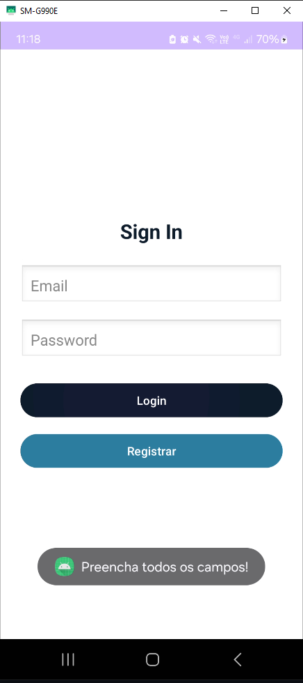
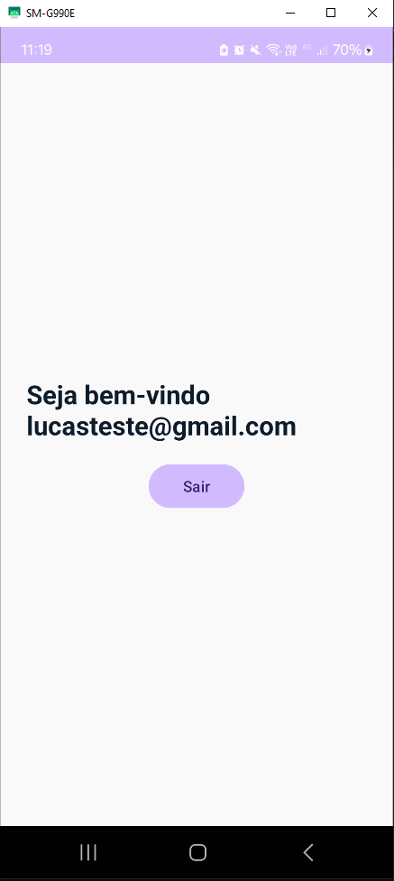

# 📱 Aplicativo de Login com Firebase Authentication

Este projeto consiste no desenvolvimento de um aplicativo mobile utilizando **Firebase Authentication** para autenticação de usuários via **e-mail e senha**, com interface desenvolvida em **XML** e lógica de programação em **Kotlin** no **Android Studio**.

## 🎯 Objetivo

Criar um app simples e funcional que permita:

- Registro de novos usuários com e-mail e senha.
- Login de usuários previamente registrados.
- Exibição de uma mensagem de boas-vindas após login bem-sucedido.
- Interface amigável com usabilidade intuitiva.

## ✨ Funcionalidades

✅ Tela de Login  
✅ Tela de Registro  
✅ Integração com Firebase Authentication  
✅ Verificações de campos obrigatórios  
✅ Redirecionamento para tela inicial após login  
✅ Interface limpa e moderna com XML  

## 💻 Tecnologias Utilizadas

- **Linguagem:** Kotlin  
- **IDE:** Android Studio  
- **Firebase Authentication**  
- **XML** (para construção da interface)  

## 🧭 Navegação pelas Telas

As seguintes imagens demonstram o fluxo e funcionamento do aplicativo:

| Screenshot | Descrição |
|-----------|-----------|
|  | **Tela de Login:** onde o usuário insere seu e-mail e senha para autenticação. |
|  | **Tela de Registro:** permite que novos usuários se cadastrem no sistema. |
|  | **Validação de Campos:** exibida quando o usuário tenta prosseguir sem preencher os campos obrigatórios. |
|  | **Tela de Boas-Vindas:** apresentada após login bem-sucedido, confirmando a autenticação. |

## 🔧 Estrutura do Projeto

- `MainActivity.kt`: Tela de login
- `RegisterActivity.kt`: Tela de registro de usuários
- `WelcomeActivity.kt`: Tela exibida após login com sucesso
- `activity_main.xml`: Layout da tela de login
- `activity_register.xml`: Layout da tela de registro
- `activity_welcome.xml`: Layout da tela de boas-vindas
- `google-services.json`: Arquivo de configuração do Firebase
- `AndroidManifest.xml`: Declaração das atividades e permissões

## 🚀 Como Executar

1. Clone o repositório:

```
git clone https://github.com/Luskinha04/app-Login-Firebase.git
```

2. Abra no Android Studio.

3. Instale as dependências necessárias e sincronize o Gradle.

4. Execute o app em um emulador ou dispositivo Android.

> ⚠️ Certifique-se de configurar corretamente o Firebase e adicionar seu `google-services.json` na pasta `app/`.

---

> **IFTM - Instituto Federal do Triângulo Mineiro**  
> **Curso:** Análise e Desenvolvimento de Sistemas  
> **Disciplina:** Programação para Dispositivos Móveis  
> **Período:** 6º Semestre
